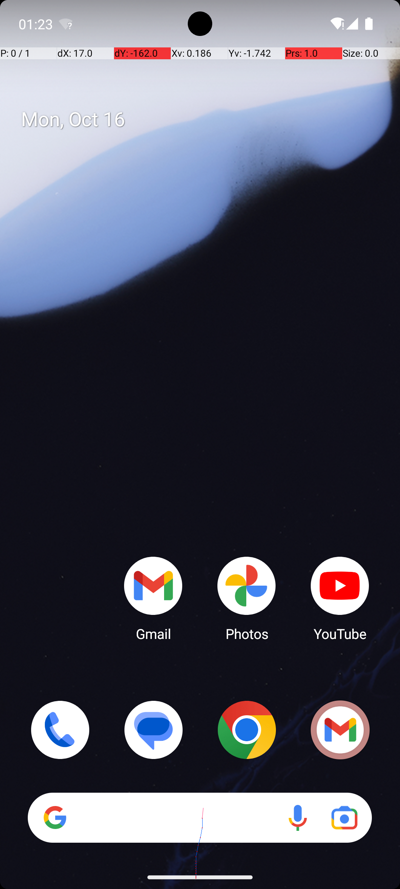

# QualGent Research Advanced Challenge: From Screen Recording to Action-Optimized Prompts 

## Setup and Infrastructure

- Android Environment: Use the AndroidWorld benchmark with a real Android device or emulator to perform UI tasks and gather observations.
- Prompt Management: Use a database or structured storage (e.g., JSON files, a simple database) to track prompt versions, performance metrics, and adaptations.
- Results Logging: Create a dedicated results/ directory structure to store logs, including:
  - Initial prompts.
  - Prompts generated by Gemini 2.5 (from vision).
  - Prompts optimized by Text2Grad.
  - Prompts improved by ARPO.
  - Actions generated by the LLM for each prompt.
  - Rewards obtained from the Android environment.
  - Screenshots/Video segments associated with each interaction.
- LLM Integration: Ensure the HFLLMAgent can seamlessly switch between different LLM models and prompt templates. 

## Iteration Loop Phases

The optimization loop will consist of the following phases, executed iteratively: 

**Phase 1: Initial Prompt Generation (Gemini 2.5 pro)**

**Objective:** Generate a baseline prompt (or a set of initial prompts) from visual information of the Android UI task.

**Steps:**
- Task Definition: For each Android UI task, capture video demonstrations or key screenshots of the target UI state and the desired interaction sequence.
- Vision-to-Prompt Conversion (gemini_prompting.py):
  - Input these video/screenshot observations to Gemini 2.5.
  - Prompt Gemini 2.5 to generate a text description of the UI, identify interactive elements, and suggest high-level instructions to achieve the task goal.
  - Gemini 2.5's reasoning capabilities can help here.
  - Focus on clear and specific prompts to Gemini 2.5 to get concise and useful descriptions.
  - Use techniques like breaking down complex tasks into smaller, logical steps for Gemini.
  - Experiment with prompt engineering techniques like adding few-shot examples to guide Gemini 2.5 towards desired output formats.
  - Store the generated prompt string (P0) and the visual context in your prompt management system.
- Baseline Evaluation: Execute the task in AndroidWorld using the LLM Agent driven by P0. Record performance metrics (Success Rate, Steps to Completion, etc.) and save logs in results/. 

**Phase 2: Black-Box Prompt Optimization (Text2Grad)**

**Objective:** Iteratively improve the prompt string (P0) to enhance LLM Agent performance, treating the LLM and environment as a black box.

**Steps:**
- Prompt Perturbation (text2grad_opt.py): Text2Grad will generate variations of the current best prompt (e.g., P0, P1, etc.) using techniques like:
  - Synonym replacement.
  - Sentence restructuring.
  - Adding or removing clarifying phrases.
  - Adjusting the order of prompt content.
  - Generating analogous tasks if the model struggles.
  - Utilize techniques like changing phrasing.
- Evaluation (arpo_runner.py with LLM Agent): Execute the Android UI task with the LLM Agent using each generated prompt variation.
- Performance Feedback: Measure task success and efficiency in the Android environment. This provides a scalar reward (e.g., 1 for success, 0 for failure, with penalties for steps taken).
- Prompt Selection: Text2Grad analyzes the performance of each prompt variation and selects the best one.
- Iteration: Repeat steps 1-4 for a set number of Text2Grad optimization epochs or until performance plateaus.
- Store Results: Log all generated prompts, actions, rewards, and the current best prompt (P_T2G) at the end of this phase in results/. 

**Phase 3: Reinforcement Learning Prompt Policy Improvement (ARPO)**

**Objective:** Learn a policy for dynamically generating or refining prompts based on environment observations, using ARPO's reinforcement learning capabilities.

**Steps:**
- State Representation: Define the state for ARPO. This could include:
  - Processed UI observations (from process_android_observation).
  - Current task goal.
  - History of previous actions and observations.
  - The current prompt being used.
- Action Space (for prompt modification): ARPO's actions will be modifications to the current prompt or selection from a set of prompt templates. Examples:
  - Appending a specific instruction based on UI element presence.
  - Rewriting a sentence in the prompt to emphasize a particular UI element or action type.
  - Selecting a different prompt template (e.g., switching from "navigation" to "information_extraction").
- Reward Function: The reward signal for ARPO will come directly from the Android environment:
  - Positive reward for completing sub-goals or the final task.
  - Negative reward for invalid actions or excessive steps.
  - Potentially, incorporate intermediate rewards for navigating correctly.
- ARPO Training Loop (arpo_runner.py):
  - ARPO learns to predict which prompt modification action maximizes the expected return.
  - It interacts with the environment (via the LLM Agent and Android tasks) using the currently generated/modified prompt.
  - Explore different prompt changes and evaluate their impact on the LLM Agent's performance.
  - Employ techniques like Proximal Policy Optimization (PPO) or similar to update the ARPO policy.
- Iteration: Run ARPO for a specified number of episodes, accumulating experience and updating the prompt generation/selection policy.
- Store Results: Log all prompt versions, actions, rewards, and the final prompt policy (P_ARPO) in results/. 

## Project Directories

```
├── android_world
|   ├── task_runner.py
|   ├── TASK_FILE.json
|   ├── arpo_runner.py
|   ├── results # the results of Gemini generated prompts using Android World
|   └── android_world
|       └── agents
|           ├── gemini_prompt.py # agent with Gemini prompt enhancer
|           └── gemini_prompting.py # the gemini script with the function to import    
├── arpo_runner.py
├── simulated_arpo_runner.py
├── example_screenshot_3.png
├── gemini_prompting.py
├── report.md
├── results
│   ├── gemini_prompt_task_add_item_001_2025-07-26_16-09-29.json
│   ├── gemini_prompt_task_add_item_001_2025-07-26_16-11-11.json
│   ├── gemini_prompt_task_add_item_001_2025-07-26_16-30-45.json
│   ├── gemini_prompt_task_click_gmail_001_2025-07-26_16-09-36.json
│   ├── gemini_prompt_task_click_gmail_001_2025-07-26_16-11-19.json
│   ├── gemini_prompt_task_click_gmail_001_2025-07-26_16-30-54.json
│   ├── gemini_prompt_task_nav_settings_001_2025-07-26_16-09-24.json
│   ├── gemini_prompt_task_nav_settings_001_2025-07-26_16-11-02.json
│   ├── gemini_prompt_task_nav_settings_001_2025-07-26_16-30-37.json
│   ├── logs
│   │   ├── gemini_prompt_AddContact.log
│   │   └── gemini_prompt_SmsReply.log
│   └── text2grad_logs
│       ├── text2grad_opt_task_calculator_multiply_task_epoch_1_2025-07-26_18-24-45.json
│       ├── text2grad_opt_task_calculator_multiply_task_epoch_2_2025-07-26_18-24-45.json
│       └── text2grad_opt_task_calculator_multiply_task_epoch_3_2025-07-26_18-24-45.json
├── Screenshot_1753561472.png
├── Screenshot_1753561726.png
└── text2grad_opt.py
```
# The Gemini 2.5 pro Generated Prompts

To generate prompts using Gemini we wrote the `gemini_prompting.py` file with the `generate_prompt_from_screenshot` function that call Gemini with a prompt and screenshot of the emulator. The file can be called as a script and it will generate three images if the predetermined images are not in the directory (two squares of a color images and a home screenshot of the emulator) and called Gemini to output the prompt. 

We used three predetermined images description prompt as "Identify buttons, text fields, and icons clearly." and the corresponding task goals as examples:

|  | |  |
|:----------------------------------------------:|:----------------------------------------------:|:----------------------------------------------:|
| Task Goal: Click the Contacts app button.             | Task Goal: Click the 'Create New Contact' button.             | Task Goal: Open the settings menu and navigate to display options.             |

## Evaluation with Android World

To evaluate the Gemini prompts within the Android World benchmark we created an agent in Android World called `GeminiPrompt` in `android_world\agents\gemini_prompt.py` and modify the ACTION_SELECTION_PROMPT_TEMPLATE using a new entry for the generated prompts ('\nHere is a Gemini generated instructions based on an screenshot{generated_prompt}'). This method enhances the prompt with newly-generated content from Gemini in Android World to solve any pre-registred task. Finally, we also modify the initial minimal_task_runner.py to run with the new agent in the `task_runner.py` file.

## Run 

```
conda activate android_world
cd android_world
python task_runner.py --task=ContactsAddContact
python task_runner.py --task=SimpleSmsReply
```

## Results 

We generated prompts based on an image and enhance the android_world prompts and run the benchmark with any pre-registered task. The result of with the ContactsAddContact and the SimpleSmsReply are store in the `results/logs` directory. The logs display the Gemini generated prompt using a current screenshot image in each step.

| Task               | Max steps | From GitHub |  My run | Gemini | Reduction |
| ------------------ | --------- | ----------- | ------- | ------ | --------- |
| SimpleSmsReply     | 12        | 12          | 5       | 6      | 7         |
| ContactsAddContact | 12        | 12          | 8       | 8      | 4         |

# Prompt Optimization (Text2Grad)

To start with the Text2Grad framework, we decided to stick to the Open-Domain Question Answering evaluation that the paper does using the UltraFeedback dataset (the generated text and nature of the problem that Android World tackle fits better for this case and not the Code Generation and Summarization problems). 

We initially created our own dataset with the initial prompt fed to Gemini and the corresponding Gemini generated prompts (used to solve a task with LLM) to generate a critique and annotate them. The annotations are using "Good spans" and "Bad spans" within the sentences:

```
{
  "Good spans": [
        "A Google search bar is at the top.",
        "Various app icons are arranged in a grid."
      ],
  "Poor spans": [
        "Plan to Achieve the Goal ('Click the 'Add New Item' button'):",
        "The provided screenshot does *not* contain an \"Add New Item\" button. Therefore, the task cannot be completed on this screen."
      ]
}
```

```
conda activate text2grad
cd Text2Grad-Reinforcement-Learning-from-Natural-Language-Feedback
python rm_data_anno/ultrafeedback/dual_feedback_annotation_RM.py
```

## Run Analysis

We did this step using the `dual_feedback_annotation_RM.py` file with GPT 4.1 to generate the critiques and the "Good spans" and "Bad spans" in the Gemini generated prompt. We then move to the second step of this framework and we realize we don't have CUDA-based GPU to train the model with the generated and annotated data. The framework also don't give any checkpoint file that contain a model to use for inference. Thus, we moved to use a custom optimizer that evaluates prompts using the Android World environment and initialized with Gemini generated prompt. 

To run the optimizer and test prompts with Android World:

```
conda activate android_world
cd android_world
python text2grad_opt.py --task ContactsAddContact
```

To run the optimizer in simulation mode and return a random generated code as a placeholder:
```
python QualGent_Research_Advanced_Challenge/text2grad_opt.py
```

## Optimizer Results

We run the optimizer in three epochs and add three small perturbations in the prompt of the ContactsAddContact task and computed a score using the following:

$`performance\_score = 10*result\_success - 0.1*result\_steps`$

The best score resulted to be 9.3 and there were multiple prompts that achieve the same best score. These cases reduce the the total steps or episode length to 7 steps.

| Task               | Max steps | From GitHub |  My run | Gemini | Optimizer | Reduction |
| ------------------ | --------- | ----------- | ------- | ------ | --------- | --------- |
| ContactsAddContact | 12        | 12          | 8       | 8      | 7         | 5         |

# Action-Aware Reinforcement Prompt Optimization (ARPO)

We were unable to run a the ARPO evaluation. The run presented issues with the /dev/kvm devices setup that was expecting. We couldn't run even after installing a VM manager compatible with MacOs (VMWare Fusion) due to lack of CUDA devices that they use to run the model.

## Run Analysis

To run the arpo runner in the Android World environment:

```
conda activate android_world
cd android_world
python arpo_runner.py
```

To run the simulated arpo runner to evaluate LLAMA outputs:

```
python simulated_arpo_runner.py
```

## ARPO Results 

We simulated ARPO using a simple reward function (x is True when the task is successful and False when it fails):
    $$
    reward(x) = \begin{cases}
    1 & x = True \\
    0 & x = False
    \end{cases}
    $$

We then run we Android World environment (only 2 tasks) and we obtained the following results:

```
=== Overall Evaluation Results ===
  Total tasks evaluated: 2
  Total successes: 1
  Success rate: 50.00%
  Average steps per successful task: 9.50
  Total reward: 1.00
```

We summarize the results in the following Table where we compared with previous attempts too:

| Task               | Max steps | From GitHub |  My run | Gemini | Optimizer | ARPO Optimizer | Reduction |
| ------------------ | --------- | ----------- | ------- | ------ | --------- | -------------- | --------- |
| SimpleSmsReply     | 12        | 12          | 5       | 6      |           | 12             | 7         |
| ContactsAddContact | 12        | 12          | 8       | 8      | 7         | 7              | 5         |

## Simulated ARPO runner

We also included a simulated ARPO runner to evaluate another model "meta-llama/Llama-3.1-8B-Instruct" in other simulated tasks and we found that the model fails every time two answer in the format that it was given and the output is not coherent with the task and role that is assigned. We concluded that GPT 4.1 is a superior model when compared outputs of two models since it quickly understand the task and the role moving fast to answer in the correct format. 

# Considerations for improvements

Add more realistic variations in the prompt. Here are some strategies for "real variations" and the corresponding code modifications:
- Synonym Replacement: Replace certain keywords with synonyms.
- Phrase Rewriting/Reordering: Change the phrasing or order of key instructions.
- Adding/Removing Specificity: Make instructions more or less specific.
- Action Emphasis: Highlight certain types of actions (e.g., "click" vs. "input").
- Context Expansion/Reduction: Add or remove parts of the UI description.